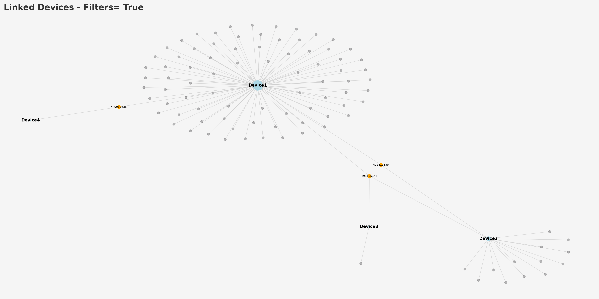

# BerlaTools

## Tools to simplify analysis of BERLA iVe data.
Work in progress.\
Python tools to analyse data from Berla iVe extracts in CSV format.
#
1. ### **berlaJoin** - brings in device friendly name and details to contacts, SMS and call CSV's so you dont have to look up MAC addresses etc. Also normalises timestamps allowing easier analysis with other software.
2. ### **berlaLocation** - Corrects the issue with the inconsistent time format which Berla uses and convets times to a fomrat accepted by other analysis programs such as ERRI ArcGIS or IBM i2. Converted times are located in a column called DateTime. Origonal timestamp also included for comparison.

3. ### **berlaNetwork** - Work in progress. Utilises networkx and pandas to analyse common numbers between paired devices and generate a visualisation.

#
## Dependencies
Built and tested on python 3.8 but other versions of 3 should be fine. 
#### Requires **PANDAS** and **TQDM** to be installed.

https://pandas.pydata.org

`pip3 install tqdm`

https://github.com/tqdm/tqdm

`pip3 install tqdm`

### **berlaNetwork** also requires **networkX** and **Matplotlib**

https://networkx.github.io

`pip3 install networkx`

https://matplotlib.org

`pip3 install matplotlib`

#
## Usage
Place the python file is the same direcotry as CSV files to be analysed.

berlaNetwork will default to loading a sample dataset from /samples/Contact1.csv to ensure networkx and matplotlib are working correctly. Once it is working open the file in an editor and modify the line in the file to read `demo_mode = False`

Then run with run with `python3 berlaJoin.py` , `python3 berlaNetwork.py` or `python3 berlaLocation.py`.
Converted files will be output to the same directory.\
As always you must verify the results.

## Known issues. 
If phone numbers are populated in all fields, i.e. PhoneNumber, MobileNumber etc. only the number from PhoneNumber is currently plotted.
Phone numbers will not currently match if they are stored differently in other devices, i.e with / without country codes.